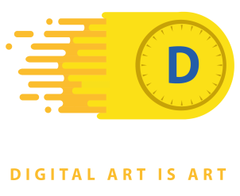

<div align="center">
  
</div>

_Welcome to DIIART, we are a project dedicated to show collections, categories, and NFTs easily, as well as an NFT Marketplace, we provide a UI and UX intuitively._

<div align="center">

| **Summary** |
| ------ |
| [1. Getting Started](#intro) |
| [* Pre-requirements](#pre-requirements) |
| [* Installation](#installation) |
| [* Execution](#execution) |
| [2. Stack](#stack) |
| [2. License](#license) |
| [3. Acknowledgments](#acknowledgments) |

</div>

<a name="intro"></a>

#
## **Getting Started** 🚀

<a name="pre-requirements"></a>

### **1. Pre-requirements** 📋

_In order to start developing with us and improve the site, you must clone the front-end repository in this case:_

- **Front-end:**
```
git clone git@github.com:No-Country/C6-04.git
```

<a name="installation"></a>

### **2. Installation** 🔧

1. _Inside the "client" and/or "api" folder_

2. _Install the project dependencies with the following code:_
```sh
npm install #or
yarn
```

<a name="execution"></a>

### **3. Execution:** ⚙️

> _Inside the "client" folder, start the following code:_

**1.** Running in production mode on the Front-end
```sh
npm start #or
yarn start
```

<a name="stack"></a>

#
## **Stack MERN** 📚

### Frontend:
 - React
 - React Router Dom
 - Axios
 - TailwindCSS and DaisyUI

### Backend:
 - MongoDB
 - Express-js
 - Node.js
 - MongoDB

<a name="license"></a>

#
## **License** 📄

This project is under the MIT License.

<a name="acknowledgments"></a>

#
## **Acknowledgments** 🎁

* Tell others about this project 📢.
* Invite someone on the team to have a beer 🍺 or a coffee ☕.
* Give thanks publicly 👨‍💻.
